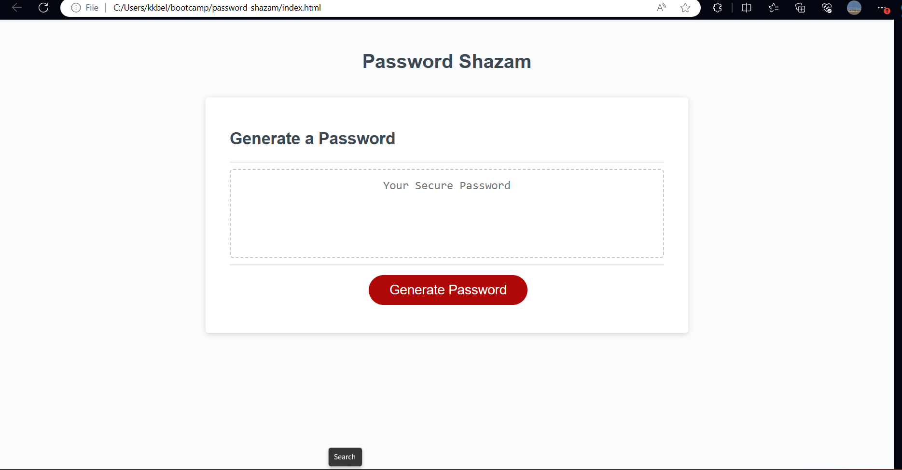

# password-shazam
password generator
//password generator

//needs to be 8 characters long no more then 128.

//asked for character types to include in the password.

//wheather or not to include uppercae, lowercase letters, numeric, and/or special characters.

//a prompt appears to make sure the user want the charcters.

//then a password is generated.

//either displayed in an alert or written to the page.

